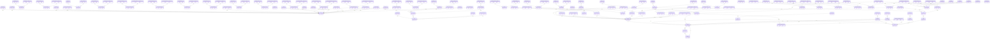

```mermaid
erDiagram
    accesoriovano {
        id INT PK
    }
    amortiguador {
        id INT PK
    }
    armario {
        id INT PK
    }
    armario_estructura_ssee {
        id INT PK
    }
    armario_oocc {
        id INT PK
    }
    bancobaterias {
        id INT PK
    }
    bancobaterias_estructura_ssee {
        id INT PK
    }
    bancobaterias_oocc {
        id INT PK
    }
    bancocondensador {
        id INT PK
    }
    bancocondensador_estructura_ssee {
        id INT PK
    }
    bancocondensador_oocc {
        id INT PK
    }
    barra {
        id INT PK
    }
    barra_estructura_ssee {
        id INT PK
    }
    barra_oocc {
        id INT PK
    }
    bienequipovehiculo {
        id INT PK
    }
    cableguardia {
        id INT PK
    }
    camara {
        id INT PK
    }
    camara_oocc {
        id INT PK
    }
    casaserviciosgenerales {
        id INT PK
    }
    casaserviciosgenerales_estructura_ssee {
        id INT PK
    }
    casaserviciosgenerales_oocc {
        id INT PK
    }
    celda {
        id INT PK
    }
    celda_estructura_ssee {
        id INT PK
    }
    celda_oocc {
        id INT PK
    }
    circuito {
        id INT PK
    }
    compensadoractivo {
        id INT PK
    }
    compensadoractivo_estructura_ssee {
        id INT PK
    }
    compensadoractivo_oocc {
        id INT PK
    }
    compensadorestaticoreactivo {
        id INT PK
    }
    compensadorestaticoreactivo_estructura_ssee {
        id INT PK
    }
    compensadorestaticoreactivo_oocc {
        id INT PK
    }
    completitudcalidadempresa {
        id INT PK
    }
    completitudcalidadportipoinstalacion {
        id INT PK
    }
    comuna {
        id INT PK
    }
    condensadoracoplamiento {
        id INT PK
    }
    condensadoracoplamiento_estructura_ssee {
        id INT PK
    }
    condensadoracoplamiento_oocc {
        id INT PK
    }
    condensadorserie {
        id INT PK
    }
    condensadorserie_estructura_ssee {
        id INT PK
    }
    condensadorserie_oocc {
        id INT PK
    }
    condensadorsincrono {
        id INT PK
    }
    condensadorsincrono_estructura_ssee {
        id INT PK
    }
    condensadorsincrono_oocc {
        id INT PK
    }
    conductor {
        id INT PK
    }
    controladorbahia {
        id INT PK
    }
    declaracionestudioambiental {
        id INT PK
    }
    declaracionestudioambiental_linea {
        id INT PK
    }
    declaracionestudioambiental_subestacion {
        id INT PK
    }
    desconectador {
        id INT PK
    }
    desconectador_estructura_ssee {
        id INT PK
    }
    desconectador_oocc {
        id INT PK
    }
    dispositivoreconexion {
        id INT PK
    }
    dispositivoreconexion_estructura_ssee {
        id INT PK
    }
    dispositivoreconexion_oocc {
        id INT PK
    }
    elementocomunarmario {
        id INT PK
    }
    elementocomunpano {
        id INT PK
    }
    elementocomunpano_oocc {
        id INT PK
    }
    elementocomunpatiossee {
        id INT PK
    }
    elementocomunpatiossee_estructura_ssee {
        id INT PK
    }
    elementocomunpatiossee_oocc {
        id INT PK
    }
    elementocomunssee {
        id INT PK
    }
    elementocomunssee_estructura_ssee {
        id INT PK
    }
    elementocomunssee_oocc {
        id INT PK
    }
    elementocomunssggcaseta {
        id INT PK
    }
    elementocomunssggcaseta_estructura_ssee {
        id INT PK
    }
    elementocomunssggcaseta_oocc {
        id INT PK
    }
    empresa {
        id INT PK
    }
    equipocomunicacion {
        id INT PK
    }
    equipommoo {
        id INT PK
    }
    equipooplat {
        id INT PK
    }
    espaciador {
        id INT PK
    }
    estacionrepetidora {
        id INT PK
    }
    estacionrepetidora_servidumbre {
        id INT PK
    }
    estructura {
        id INT PK
    }
    estructura_oocc {
        id INT PK
    }
    estructuraestacionrepetidora {
        id INT PK
    }
    estructuraestacionrepetidora_oocc {
        id INT PK
    }
    generadorenergia {
        id INT PK
    }
    generadorenergia_estructura_ssee {
        id INT PK
    }
    generadorenergia_oocc {
        id INT PK
    }
    grupo {
        id INT PK
    }
    interruptor {
        id INT PK
    }
    interruptor_estructura_ssee {
        id INT PK
    }
    interruptor_oocc {
        id INT PK
    }
    linea {
        id INT PK
    }
    marcolinea {
        id INT PK
    }
    marcolinea_oocc {
        id INT PK
    }
    medidor {
        id INT PK
    }
    monitorlinea {
        id INT PK
    }
    mufa {
        id INT PK
    }
    mufa_oocc {
        id INT PK
    }
    multiplexador {
        id INT PK
    }
    otroelementosistemacontrol {
        id INT PK
    }
    otroelementosistemacontrol_estructura_ssee {
        id INT PK
    }
    otroelementosistemacontrol_oocc {
        id INT PK
    }
    otroelementosistemaproteccion {
        id INT PK
    }
    otroelementotelecomunicacion {
        id INT PK
    }
    panelantirruido {
        id INT PK
    }
    pano {
        id INT PK
    }
    pano_estructura_ssee {
        id INT PK
    }
    pano_oocc {
        id INT PK
    }
    pararrayo {
        id INT PK
    }
    pararrayo_estructura_ssee {
        id INT PK
    }
    pararrayo_oocc {
        id INT PK
    }
    pararrayomufa {
        id INT PK
    }
    pararrayomufa_estructura_ssee {
        id INT PK
    }
    pararrayomufa_oocc {
        id INT PK
    }
    patiomufas {
        id INT PK
    }
    patiomufas_oocc {
        id INT PK
    }
    patiosubestacion {
        id INT PK
    }
    patiosubestacion_estructura_ssee {
        id INT PK
    }
    patiosubestacion_oocc {
        id INT PK
    }
    provincia {
        id INT PK
    }
    reactor {
        id INT PK
    }
    reactor_estructura_ssee {
        id INT PK
    }
    reactor_oocc {
        id INT PK
    }
    region {
        id INT PK
    }
    releproteccion {
        id INT PK
    }
    seccionbarra {
        id INT PK
    }
    servicioauxiliar {
        id INT PK
    }
    servidumbre {
        id INT PK
    }
    subestacion {
        id INT PK
    }
    subestacion_estructura_ssee {
        id INT PK
    }
    subestacion_oocc {
        id INT PK
    }
    subestacion_servidumbre {
        id INT PK
    }
    tablero {
        id INT PK
    }
    tablero_estructura_ssee {
        id INT PK
    }
    tablero_oocc {
        id INT PK
    }
    teleproteccion {
        id INT PK
    }
    torre {
        id INT PK
    }
    torre_oocc {
        id INT PK
    }
    tramo {
        id INT PK
    }
    tramo_servidumbre {
        id INT PK
    }
    transformador2d {
        id INT PK
    }
    transformador2d_estructura_ssee {
        id INT PK
    }
    transformador2d_oocc {
        id INT PK
    }
    transformador3d {
        id INT PK
    }
    transformador3d_estructura_ssee {
        id INT PK
    }
    transformador3d_oocc {
        id INT PK
    }
    transformadorcorriente {
        id INT PK
    }
    transformadorcorriente_estructura_ssee {
        id INT PK
    }
    transformadorcorriente_oocc {
        id INT PK
    }
    transformadorpotencial {
        id INT PK
    }
    transformadorpotencial_estructura_ssee {
        id INT PK
    }
    transformadorpotencial_oocc {
        id INT PK
    }
    transformadorssaa {
        id INT PK
    }
    transformadorssaa_estructura_ssee {
        id INT PK
    }
    transformadorssaa_oocc {
        id INT PK
    }
    transformadorzigzag {
        id INT PK
    }
    transformadorzigzag_estructura_ssee {
        id INT PK
    }
    transformadorzigzag_oocc {
        id INT PK
    }
    tunel {
        id INT PK
    }
    tunel_estructura_ssee {
        id INT PK
    }
    tunel_oocc {
        id INT PK
    }
    vano {
        id INT PK
    }
    accesoriovano ||--o{ vano : contains
    amortiguador ||--o{ vano : contains
    armario_estructura_ssee ||--o{ armario : contains
    armario_oocc ||--o{ armario : contains
    bancobaterias_estructura_ssee ||--o{ bancobaterias : contains
    bancobaterias_oocc ||--o{ bancobaterias : contains
    bancocondensador_estructura_ssee ||--o{ bancocondensador : contains
    bancocondensador_oocc ||--o{ bancocondensador : contains
    barra_estructura_ssee ||--o{ barra : contains
    barra_oocc ||--o{ barra : contains
    bienequipovehiculo ||--o{ subestacion : contains
    cableguardia ||--o{ vano : contains
    camara ||--o{ comuna : contains
    camara ||--o{ linea : contains
    camara_oocc ||--o{ camara : contains
    casaserviciosgenerales ||--o{ subestacion : contains
    casaserviciosgenerales_estructura_ssee ||--o{ casaserviciosgenerales : contains
    casaserviciosgenerales_oocc ||--o{ casaserviciosgenerales : contains
    celda_estructura_ssee ||--o{ celda : contains
    celda_oocc ||--o{ celda : contains
    circuito ||--o{ linea : contains
    compensadoractivo_estructura_ssee ||--o{ compensadoractivo : contains
    compensadoractivo_oocc ||--o{ compensadoractivo : contains
    compensadorestaticoreactivo_estructura_ssee ||--o{ compensadorestaticoreactivo : contains
    compensadorestaticoreactivo_oocc ||--o{ compensadorestaticoreactivo : contains
    completitudcalidadempresa ||--o{ empresa : contains
    completitudcalidadportipoinstalacion ||--o{ empresa : contains
    comuna ||--o{ provincia : contains
    comuna ||--o{ region : contains
    condensadoracoplamiento_estructura_ssee ||--o{ condensadoracoplamiento : contains
    condensadoracoplamiento_oocc ||--o{ condensadoracoplamiento : contains
    condensadorserie_estructura_ssee ||--o{ condensadorserie : contains
    condensadorserie_oocc ||--o{ condensadorserie : contains
    condensadorsincrono_estructura_ssee ||--o{ condensadorsincrono : contains
    condensadorsincrono_oocc ||--o{ condensadorsincrono : contains
    conductor ||--o{ vano : contains
    controladorbahia ||--o{ armario : contains
    declaracionestudioambiental_linea ||--o{ declaracionestudioambiental : contains
    declaracionestudioambiental_linea ||--o{ linea : contains
    declaracionestudioambiental_subestacion ||--o{ declaracionestudioambiental : contains
    declaracionestudioambiental_subestacion ||--o{ subestacion : contains
    desconectador_estructura_ssee ||--o{ desconectador : contains
    desconectador_oocc ||--o{ desconectador : contains
    dispositivoreconexion_estructura_ssee ||--o{ dispositivoreconexion : contains
    dispositivoreconexion_oocc ||--o{ dispositivoreconexion : contains
    elementocomunarmario ||--o{ armario : contains
    elementocomunpano ||--o{ pano : contains
    elementocomunpano_oocc ||--o{ elementocomunpano : contains
    elementocomunpatiossee_estructura_ssee ||--o{ elementocomunpatiossee : contains
    elementocomunpatiossee_oocc ||--o{ elementocomunpatiossee : contains
    elementocomunssee ||--o{ subestacion : contains
    elementocomunssee_estructura_ssee ||--o{ elementocomunssee : contains
    elementocomunssee_oocc ||--o{ elementocomunssee : contains
    elementocomunssggcaseta_estructura_ssee ||--o{ elementocomunssggcaseta : contains
    elementocomunssggcaseta_oocc ||--o{ elementocomunssggcaseta : contains
    empresa ||--o{ grupo : contains
    equipocomunicacion ||--o{ armario : contains
    equipommoo ||--o{ armario : contains
    equipooplat ||--o{ armario : contains
    espaciador ||--o{ vano : contains
    estacionrepetidora ||--o{ tramo : contains
    estacionrepetidora_servidumbre ||--o{ estacionrepetidora : contains
    estacionrepetidora_servidumbre ||--o{ servidumbre : contains
    estructura ||--o{ comuna : contains
    estructura ||--o{ linea : contains
    estructura_oocc ||--o{ estructura : contains
    estructuraestacionrepetidora_oocc ||--o{ estructuraestacionrepetidora : contains
    generadorenergia_estructura_ssee ||--o{ generadorenergia : contains
    generadorenergia_oocc ||--o{ generadorenergia : contains
    interruptor_estructura_ssee ||--o{ interruptor : contains
    interruptor_oocc ||--o{ interruptor : contains
    marcolinea ||--o{ comuna : contains
    marcolinea ||--o{ linea : contains
    marcolinea_oocc ||--o{ marcolinea : contains
    medidor ||--o{ armario : contains
    monitorlinea ||--o{ vano : contains
    mufa_oocc ||--o{ mufa : contains
    multiplexador ||--o{ armario : contains
    otroelementosistemacontrol ||--o{ armario : contains
    otroelementosistemacontrol ||--o{ pano : contains
    otroelementosistemacontrol_estructura_ssee ||--o{ otroelementosistemacontrol : contains
    otroelementosistemacontrol_oocc ||--o{ otroelementosistemacontrol : contains
    otroelementosistemaproteccion ||--o{ armario : contains
    otroelementotelecomunicacion ||--o{ armario : contains
    panelantirruido ||--o{ subestacion : contains
    pano ||--o{ barra : contains
    pano_estructura_ssee ||--o{ pano : contains
    pano_oocc ||--o{ pano : contains
    pararrayo_estructura_ssee ||--o{ pararrayo : contains
    pararrayo_oocc ||--o{ pararrayo : contains
    pararrayomufa ||--o{ mufa : contains
    pararrayomufa_estructura_ssee ||--o{ pararrayomufa : contains
    pararrayomufa_oocc ||--o{ pararrayomufa : contains
    patiomufas_oocc ||--o{ patiomufas : contains
    patiosubestacion ||--o{ subestacion : contains
    patiosubestacion_estructura_ssee ||--o{ patiosubestacion : contains
    patiosubestacion_oocc ||--o{ patiosubestacion : contains
    provincia ||--o{ region : contains
    reactor_estructura_ssee ||--o{ reactor : contains
    reactor_oocc ||--o{ reactor : contains
    releproteccion ||--o{ armario : contains
    seccionbarra ||--o{ barra : contains
    servicioauxiliar ||--o{ armario : contains
    servidumbre ||--o{ comuna : contains
    subestacion ||--o{ comuna : contains
    subestacion_estructura_ssee ||--o{ subestacion : contains
    subestacion_oocc ||--o{ subestacion : contains
    subestacion_servidumbre ||--o{ subestacion : contains
    subestacion_servidumbre ||--o{ servidumbre : contains
    tablero_estructura_ssee ||--o{ tablero : contains
    tablero_oocc ||--o{ tablero : contains
    teleproteccion ||--o{ armario : contains
    torre ||--o{ comuna : contains
    torre ||--o{ linea : contains
    torre_oocc ||--o{ torre : contains
    tramo ||--o{ circuito : contains
    tramo_servidumbre ||--o{ tramo : contains
    tramo_servidumbre ||--o{ servidumbre : contains
    transformador2d_estructura_ssee ||--o{ transformador2d : contains
    transformador2d_oocc ||--o{ transformador2d : contains
    transformador3d_estructura_ssee ||--o{ transformador3d : contains
    transformador3d_oocc ||--o{ transformador3d : contains
    transformadorcorriente_estructura_ssee ||--o{ transformadorcorriente : contains
    transformadorcorriente_oocc ||--o{ transformadorcorriente : contains
    transformadorpotencial_estructura_ssee ||--o{ transformadorpotencial : contains
    transformadorpotencial_oocc ||--o{ transformadorpotencial : contains
    transformadorssaa_estructura_ssee ||--o{ transformadorssaa : contains
    transformadorssaa_oocc ||--o{ transformadorssaa : contains
    transformadorzigzag_estructura_ssee ||--o{ transformadorzigzag : contains
    transformadorzigzag_oocc ||--o{ transformadorzigzag : contains
    tunel ||--o{ subestacion : contains
    tunel ||--o{ tramo : contains
    tunel_estructura_ssee ||--o{ tunel : contains
    tunel_oocc ||--o{ tunel : contains
    vano ||--o{ tramo : contains
```
